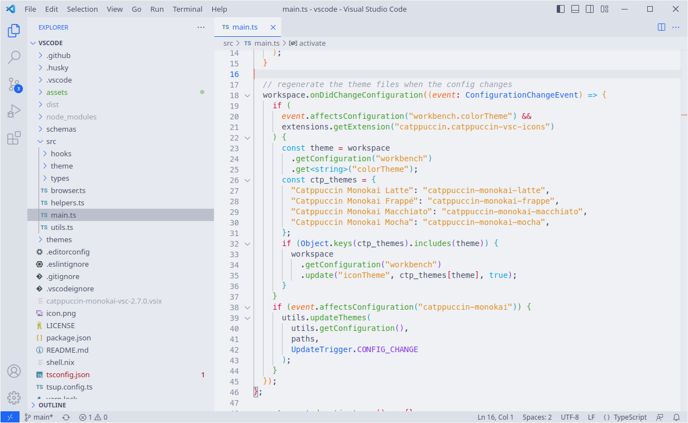
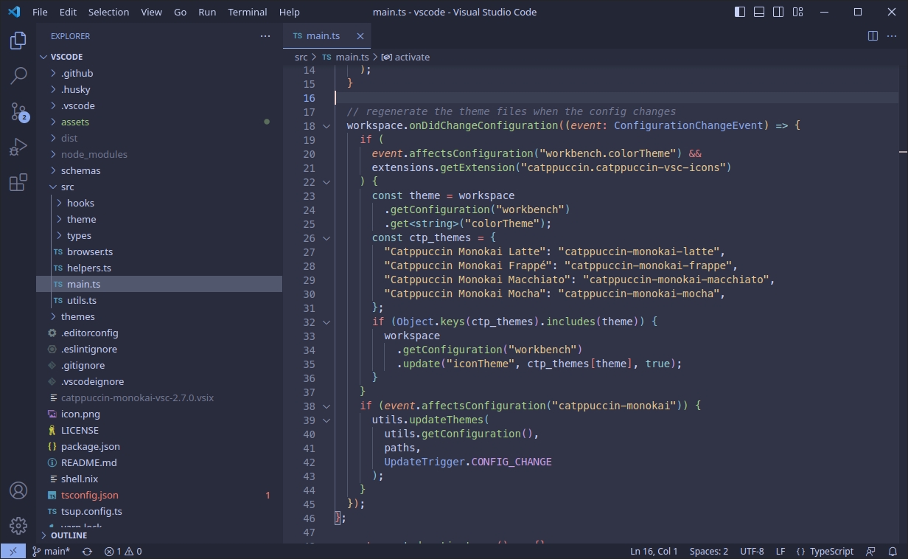
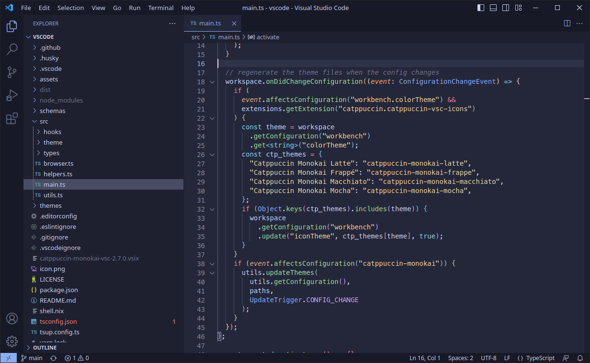
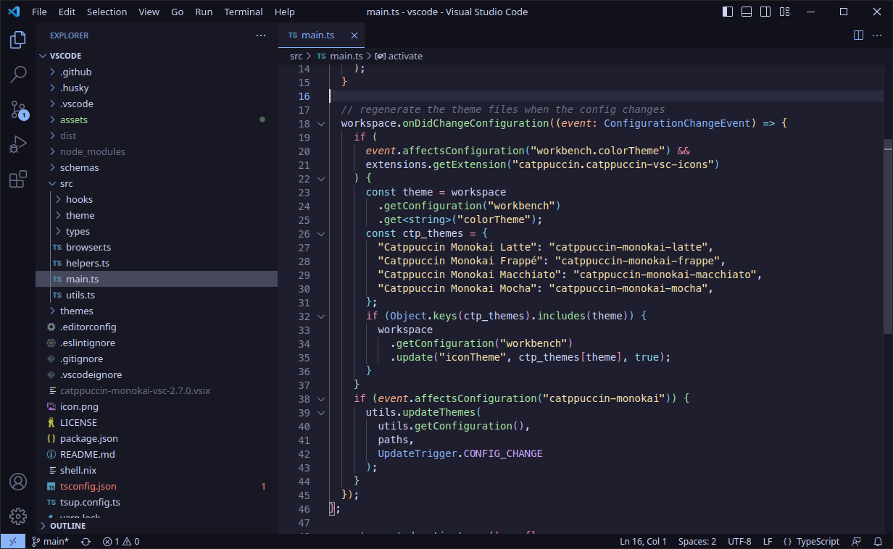

<h3 align="center">
	 
	
	Catppuccin  for <a href="https://code.visualstudio.com">VSCode</a>
	
</h3>

This is a fork of [Catppuccin VSCode](https://marketplace.visualstudio.com/items?itemName=Catppuccin.catppuccin-vsc) extension with Monokai style index highlighting using Catppuccine palette.
> **Note**\
> Get the newly released [Catppuccin Icon Pack](https://marketplace.visualstudio.com/items?itemName=Catppuccin.catppuccin-vsc-icons) now!

## Previews

🌻 Latte

🪴 Frappé

🌺 Macchiato

🌿 Mocha

## Usage
Check [Catppuccin VSCode](https://marketplace.visualstudio.com/items?itemName=Catppuccin.catppuccin-vsc) extension for detail on usage. This extension *should* support all the same settings as the original.

